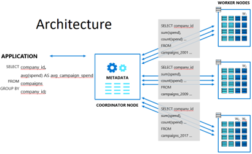
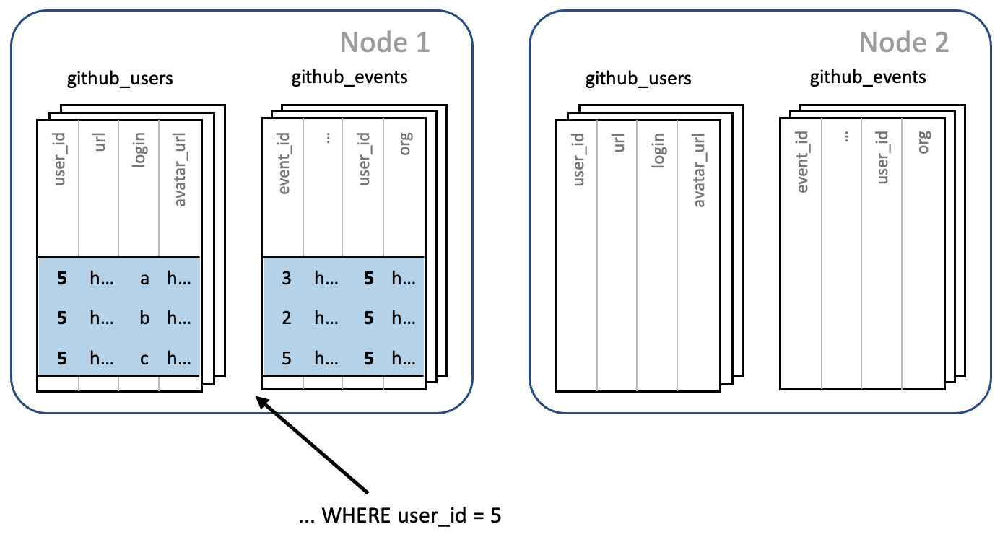
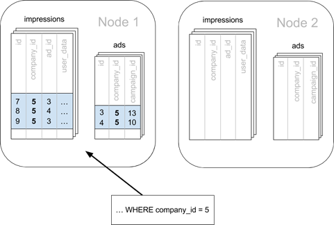
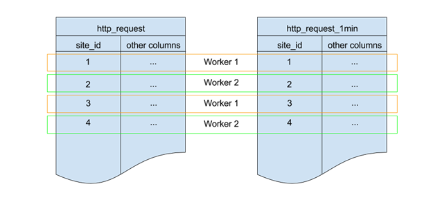

# 1. Cosmos DB for PostgreSQL (Citus) ハンズオンラボ ： はじめに
 Cosmos DB for PostgreSQL(Citus)は、クラウドで可用性の高いPostgreSQLデータベースを実行、管理、および拡張するために使用するマネージドサービスです。
 
 この手順では、Azureポータルを使用してCosmos DB for PostgreSQL(Citus)のサーバーグループを作成する方法について説明します。
 
 分散データ（ノード間でのシャーディングテーブル、サンプルデータの読み込み、複数のノードで実行されるクエリの実行）について説明します。

## 1.1 Cosmos DB for PostgreSQL (Citus) の概要
Cosmos DB for PostgreSQL(Citus) は、スケールアウトするために構築された安心なPostgreSQLです。複数のマシンのクラスターに、データ、およびクエリを配布（シャード）します。

Cosmos DB for PostgreSQL (Citus)は、（フォークではなく）拡張機能として、新しいPostgreSQLリリースをサポートしており、既存のPostgreSQLツールとの互換性を維持しながら、ユーザーが新機能の恩恵を受けられるようにします。既存のワークロードにおけるパフォーマンスとスケーラビリティの2つの主要な問題を解決します。通常のPostgreSQLと同様に、Cosmos DB for PostgreSQL (Citus)もデータベースを管理します。高可用性、バックアップ、監視、アラート、その他の追加機能を提供し、これらはPaaS（サービスとしてのプラットフォーム）の一部として提供されます。

## 1.2 Cosmos DB for PostgreSQL (Citus)のアーキテクチャ:
クラスタには、コーディネーターと呼ばれる1つの特殊ノードが必ずあります（他のノードはワーカーと呼ばれます）。

アプリケーションは、コーディネーターにクエリを送信し、コーディネーターは関連付けられたワーカーにクエリを中継し、結果を蓄積します。

各クエリについて、コーディネーターは、それを単一のワーカーにルーティングするか、必要なデータが単一あるいは複数のワーカーに存在するかに応じて、クエリをいくつかに並列化します。Cosmos DB for PostgreSQL (Citus)が複数のワーカーにクエリを分散する方法に関するシナリオを次に示します。



# 2. Cosmos DB for PostgreSQL (Citus) のサービスを作成する
まず、提供された資格情報を使用してAzureポータルにログインする必要があります。

## 2.1 Azureポータルへのサイン・イン
1. Azure Portalに既にログインしている場合は、次のページにスキップします。このウィンドウの右下にあるNextをクリックします。
2. ブラウザで `https://portal.azure.com` を開き、ブラウザのウインドウを最大化します。
3. [アカウントを選択する] というダイアログが表示されたら、[別のアカウントを使用する] を選択します。
4. [サインイン] ダイアログの、[メール、電話、Skype] フィールドに
`userxxxxxx@cloudplatimmersionlabs.onmicrosoft.com` を入力し [次へ] をクリックします。
5. [パスワード] フィールドに`xxxxxxxx`を入力します。
6. [サインイン] をクリックします。
7. [サインインの状態を維持しますか?] とタイトルがついた、[いいえ]と[はい]ボタンがあるポップアップが表示されるかもしれません。[いいえ]を選択します。
8. Welcome to Microsoft AzureとタイトルがついたStart TourとMaybe Laterボタンがあるポップアップが表示されるかもしれません。Maybe Laterを選択します。

## 2.2 Cosmos DB for PostgreSQL (Citus) の作成
これらの手順では、Azureポータルを使用してCosmos DB for PostgreSQL (Citus) サーバーグループを作成する方法について説明します。

クラスターの規模によって作成に必要な時間は変わりますが、このハンズオンで作成するサーバーグループの規模であれば、通常約10分かかります。以下の手順では、プロセスを通じてこれがいかにシンプルで簡単であるかが分かります。

## 2.3 Cosmos DB for PostgreSQL (Citus) サーバーグループを作成する
次の手順に従って、Azureポータルを使用してCosmos DB for PostgreSQL (Citus) サーバーグループを作成するプロセスを理解します。
1. Azureポータルの左上にある [+リソースの作成] をクリックします。
2. Azure Marketplaceの[リソースの作成]ページで[データベース]を選択し、[人気のAzureサービス]ページで[Cosmos DB]を選択します。
3. [PostgreSQLデプロイオプションのAzureデータベースの選択]ページで、[Cosmos DB for PostgreSQL (Citus) サーバーグループ]の下の[作成]ボタンをクリックします。
4. 以下の情報を[Cosmos DB for PostgreSQL (Citus)サーバーグループ]の基本タブに入力します。
-	サブスクリプション: あなたのセッションのサブスクリプションがデフォルトになっています。
-	リソースグループ: [新規作成]をクリックし、任意のリソースグループ名（例: `citushandsonlab_rg`）を入力します。
-	サーバーグループ名: 任意のサーバーグループ名（例: `citushandsonlab`）を入力します。
-	場所: [Japan East]あるいは任意のAzureリージョンを選択します。
-	コンピューティングとストレージ: [サーバーグループの構成]をクリックし、ハンズオンのトレーナーの指示に従ってください。通常は[階層]から[Basic]あるいは[Standard]を選択し、コーディネータとワーカーの設定はそのままにして[保存]をクリックします。
-	管理者ユーザー名: 現時点では`citus`という値がデフォルトで変更することは出来ません。
-	パスワード: `xxxxxxxx`を入力し、[パスワードの確認]にも同じパスワードを入力します。

> 注: Cosmos DB for PostgreSQL (Citus) デプロイを作成する場合、最大20のワーカーノードを水平方向にスケーリングできます。20以上のノードが必要な場合は、サポートチケットを作成するだけで、有効になります。コーディネーターと同様に、すべてのワーカー（コア、ストレージ）をスケールアップできますが、ストレージはスケールダウンが出来ません。RAMは、コア数とサーバーの種類（コーディネーターまたはワーカー）で決まります。
5. [確認および作成]をクリックするとサマリーが表示されます。サマリーを確認後、[作成]ボタンをクリックするとデプロイが開始されます。
> 注: [作成]ボタンをクリックするとデプロイが開始され、デプロイメントを監視するページにリダイレクトされます。

6. Azureポータルの左上にある[ホーム]をクリックします。
7. [Azureサービス]の下にある[Cosmos DB]をクリックします。
8. 作成時に入力したサーバーグループ名（例: `citushandsonlab`）をクリックします。
Cosmos DB for PostgreSQL (Citus)サーバーグループを管理するAzure Portalの概要タブが表示されます。この概要タブの右上には、サーバーグループへの接続に使用するコーディネーター名（例: `c.citushandsonlab.postgres.database.azure.com`）が表示されます。
9. 左にある[接続文字列]をクリックし、接続文字列を表示して確認します。
10. 左にある[コンピューティングとストレージ]をクリックし、サーバーグループを構成する各ノードのサイズを表示します。

# 3. Cosmos DB for PostgreSQL (Citus) を使ってみる

Azureポータルのクラウドシェルを使用してCosmos DB for PostgreSQL (Citus)サーバーグループに接続するには、ストレージアカウントを作成する必要があります。ストレージアカウントを使用すると、クラウドシェルに関連付けられたファイルを保存できるため、スクリプトの実行、データファイルのダウンロード、Azureリソースの管理など、さまざまなAzureポータルアクティビティで使用できます。

## 3.1 クラウドシェルを作成する
1. ポータルのバナーでクラウドシェルのアイコンをクリックします。 
2. [ストレージがマウントされていません]の画面で、[詳細設定の表示]をクリックします。
3. サブスクリプションを選択します。
4. リージョンに[東日本]あるいは任意のリージョンを選択します。
5. リソースグループは既存のCosmos DB for PostgreSQL (Citus)のサーバーグループを作成したグループあるいは任意のグループを使うようにしてください。
6. ストレージアカウントには、[新規作成]を選択し、任意のストレージアカウント名（例: `citushandsonlab`）をペーストします。
7. ファイルシェアには、[新規作成]を選択し、任意の共有ファイル名（例: `citushandsonlab`）を入力してください。
8. [作成]をクリックします。

> 注: クラウドシェルを作成・開始するのに1分程度を要します。

9. 次の手順でファイアウォールを構成するには、クラウドシェルのクライアントIPアドレスが必要です。コマンドプロンプトで次のコマンドを入力し、returnキーを押してから、クラウドシェルのIPアドレスをコピーまたはメモします。

```
curl -s https://ifconfig.co
```

> 注: bashコンソールでペーストするには右クリック後にpasteを選択します。

## 3.2 Cosmos DB for PostgreSQL (Citus) を設定する
Cosmos DB for PostgreSQL (Citus) は、サーバーレベルでファイアウォールを使用します。既定では、ファイアウォールはすべての外部アプリケーションとツールがコーディネーターノードおよび内部のデータベースに接続するのを防ぎます。特定のIPアドレス範囲からの接続を許可するルールを追加する必要があります。

### サーバーレベルのファイアウォールのルールを設定する
1. Hyperscaleサーバーグループの[ネットワーク]を選択します。
2. [ネットワーク接続]ペインの[パブリックアクセス]内で、クラウドシェルで確認した[IPアドレス]を[開始IPアドレス]と[終了IPアドレス]に入力します。
3. [ファイアウォール規則名]に[CloudShell]と入力します。
4. ペインの左上にある[保存]をクリックします。

> 注: Cosmos DB for PostgreSQL (Citus) サーバーは5432/TCPポートを介して通信します。企業ネットワーク内から接続しようとしている場合、5432/TCPポートへの送信トラフィックは、ネットワークのファイアウォールで許可されない場合があります。その場合は、IT部門が5432/TCPポートへの通信を許可しない限り、Cosmos DB for PostgreSQL (Citus) サーバーに接続できません。

## 3.3 Cosmos DB for PostgreSQL (Citus)に接続する
Cosmos DB for PostgreSQL (Citus)を作成すると、citusという名前の既定のデータベースが作成されます。

データベースサーバーに接続するには、接続文字列と管理者パスワードが必要です。最初の接続には最大2分かかる場合があります。

何らかの理由でシェルがタイムアウトして再起動した場合は、`curl -s https://ifconfig.co`コマンドをもう一度実行し、ファイアウォールが新しいIPアドレスで更新されていることを確認する必要があります。

### `psql`でデータベースに接続する
1. クラウドシェルの右上にある最大化ボックスをクリックして全画面にします。
2. Bashプロンプトで、`psql`ユーティリティを用いてCosmos DB for PostgreSQL (Citus)に接続します。最初の接続には最大2分かかる場合があります。以下のコマンドをコピー＆ペーストして[enter]を押します。

```
psql "host=c.citushandsonlab.postgres.database.azure.com port=5432 dbname=citus user=citus password='xxxxxxxx' sslmode=require"
```

## 3.4 テーブルを作成しスケールアウトする

`psql`を使用してCosmos DB for PostgreSQL (Citus) コーディネーターノードに接続すると、いくつかの基本的なタスクを完了できます。
この経験では、主に分散テーブルとそれらに慣れることに焦点を当てます。

これから作業するデータモデルは単純で、GitHubのユーザーデータとイベントデータの2つとなります。

イベントには、フォークの作成、組織に関連するgitコミットなどが含まれます。

`psql`経由で接続したら、テーブルを作成してみましょう。

3. `psql`コンソールで以下をコピー＆ペーストしてテーブルを作成します。

```
CREATE TABLE github_events(
event_id bigint,
event_type text,
event_public boolean,
repo_id bigint,
payload jsonb,
repo jsonb,
user_id bigint,
org jsonb,
created_at timestamp
);
CREATE TABLE github_users(
user_id bigint,
url text,
login text,
avatar_url text,
gravatar_id text,
display_login text
);
```

`github_events`テーブルのペイロードフィールドには、JSONBデータ型があります。JSONBはPostgreSQLのバイナリ形式のJSONデータ型です。

JSONデータ型を使用すると、柔軟なスキーマを1つの列に簡単に格納できます。PostgreSQLは、この型にGINインデックス（Generalized Inverted Index、汎用転置インデックス）を作成し、その中のすべてのキーと値にインデックスを付けることができます。インデックスを使用すると、さまざまな条件でペイロードを高速かつ簡単に照会できます。

データを読み込む前に、いくつかのインデックスを作成してみましょう。

4. `psql`コンソールで以下をコピー＆ペーストしてインデックスを作成します。
```
CREATE INDEX event_type_index ON github_events (event_type);
CREATE INDEX payload_index ON github_events USING GIN (payload jsonb_path_ops);
```

次に、コーディネーターノード上のPostgreSQLテーブルを指定し、Cosmos DB for PostgreSQL (Citus) にワーカー全体でシャードするように伝えます。

そのために、それをシャードするキーを指定する各テーブルに対してクエリを実行します。この例では、user_idのイベントテーブルとユーザーテーブルの両方をシャードします。

5. `psql`コンソールで以下をコピー＆ペーストします。
```
SELECT create_distributed_table('github_events', 'user_id');
SELECT create_distributed_table('github_users', 'user_id');
```
このコマンドはテーブルごとに、ワーカーノードにシャードを作成します。

各シャードは、一連のユーザーを保持する単純なpostgresqlテーブルです（`user_id`でシャード化したので）。

また、コーディネーターノードにメタデータを作成して、分散テーブルのセットとワーカーノードのシャードの局所性を追跡します。

`user_id`で両方のテーブルをシャードしたので、テーブルは自動的にコロケーションされます。

つまり、両方のテーブルの1つの`user_id`に関連するすべてのデータが同じワーカーノード上にあります。

これは、コロケーションされたシャード全体で、ワーカーノード上での２つのテーブル間の結合をローカルに実行する場合に役立ちます。コロケーションの詳細は次の「マルチテナントアプリケーション」で説明します。



> 注: Cosmos DB for PostgreSQL (Citus) サーバー内には、3種類のテーブルがあります。
>	- 分散テーブル – ワーカーノードを跨いで分散（スケールアウト）。一般的に大きなテーブルはパフォーマンスを改善するために分散したテーブルであるべきです。
>	- 参照テーブル – 全てのノードに複製されます。分散テーブルとの結合を可能にします。典型的には国や製品カテゴリのような小さなテーブルに用いられます。
>	- ローカルテーブル – コーディネーターノードに置かれるテーブルで、シャーディングのメタデータの管理テーブルが典型例です。

データをロードする準備が整いました。以下のコマンドでBashのクラウドシェルを「シェル実行」し、ファイルをダウンロードします。

6. `psql`コンソールでデータファイルをダウンロードするために以下をコピー＆ペーストとします。

```
\! curl -O https://examples.citusdata.com/users.csv
\! curl -O https://examples.citusdata.com/events.csv
```
7. `psql`コンソールでデータファイルをロードするために以下をコピー＆ペーストします。

```
\copy github_events from 'events.csv' WITH CSV
\copy github_users from 'users.csv' WITH CSV
```
重い本番ワークロードの場合、COPYコマンドが単一ノードのPostgresよりもCosmos DB for PostgreSQL (Citus) で高速な理由は、COPYがファンアウトされ複数のワーカーノードで並行して実行されることによります。

## 3.5 クエリの実行
ここから、実際にいくつかのクエリを実行するので、楽しい時間です。簡単なカウント(*)から始めて、読み込んだデータの量を確認します。
8. `psql`コンソールでgithub_eventsテーブルのレコードカウントを取得するために以下をコピー＆ペーストします
```
SELECT count(*) from github_events;
```
この単純なクエリは、先ほど作成されたシャードキー、`user_id`に基づいてコーディネーターがすべてのワーカーに対して伝播（プロパゲート）し、コーディネーターが集計したレコード数が返されました。
JSONBペイロード列には、多くのデータがありますが、イベントの種類によって異なります。`PushEvent`イベントには、プッシュの個別のコミットの数を含むサイズが含まれています。これを使用して、1時間あたりのコミットの合計数を検索できます。

9. `psql`コンソールで時間あたりのコミット数を見るために以下をコピー＆ペーストします。

```
SELECT date_trunc('hour', created_at) AS hour,
       sum((payload->>'distinct_size')::int) AS num_commits
FROM github_events
WHERE event_type = 'PushEvent'
GROUP BY hour
ORDER BY hour;
```

> 注: 結果ビューでスタックした場合は、[q]と入力し、[Enter]を押してビューモードを終了します。

これまでのところ、クエリには`github_events`テーブルだけが関係していましたが、この情報を`github_users`テーブルと組み合わせることができます。ユーザーとイベントの両方を同じ識別子（user_id)でシャードしたので、一致するユーザーIDを持つ両方のテーブルの行は同じワーカーノードに配置され、簡単に結合できます。`user_id`でクエリを結合すると、Cosmos DB for PostgreSQL (Citus) コーディネーターは、ワーカーノードで並行して実行するために、結合の実行をシャード、つまりワーカーノード、に指示することになります。

10. `psql`コンソールでレポジトリ数が最大のユーザを見つけるために以下をコピー＆ペーストします。

```
SELECT login, count(*)
FROM github_events ge
JOIN github_users gu
ON ge.user_id = gu.user_id
WHERE event_type = 'CreateEvent' AND
      payload @> '{"ref_type": "repository"}'
GROUP BY login
ORDER BY count(*) DESC
LIMIT 20;
```

本番ワークロードでは、次の理由により、上記のクエリはCosmos DB for PostgreSQL (Citus) 上で高速に実行されます。

- シャードが小さく、インデックスも小さい。これはリソースの利用効率の向上とインデックス/キャッシュのヒット率の向上に寄与します。
- 複数のワーカーノードによる並列実行

## 3.6 まとめ

このラボではデータベースクラスターを展開しシャーディングキーを設定することで、Microsoft Azure上でPostgreSQLを水平にスケールする方法を学びました。
他にも特にここで学んだこととして以下がありました。

-	Cosmos DB for PostgreSQL (Citus) を展開する方法
-	Azureクラウドシェルの作り方
-	`psql`を用いたCosmos DB for PostgreSQL (Citus) への接続方法
-	スキーマの作成方法、シャーディングキーの設定方法、サーバーグループへのデータのロード方法

Cosmos DB for PostgreSQL (Citus) を使用すると、PostgreSQLデータベースクラスター（「サーバーグループ」と呼ばれる）にデータとクエリを分散できるため、サーバーグループ内のすべてのノードで、すべてのメモリ、コンピューティング、およびディスクが利用できるというパフォーマンス上の利点をアプリケーションに提供できます。
自分のサブスクリプションでCosmos DB for PostgreSQL (Citus) を試してみたい場合は、以下のリンクを参照してください。

[Azure portal で Cosmos DB for PostgreSQL (Citus) サーバー グループを作成する](https://docs.microsoft.com/ja-jp/azure/postgresql/hyperscale/quickstart-create-portal)

# 4. マルチテナントアプリケーション

この経験では、Cosmos DB for PostgreSQL (Citus)上でマルチテナントアプリケーションを作成するプロセスを説明します。

サービスとしてのソフトウェア (SaaS) アプリケーションを構築する場合は、データモデルにテナントの概念が既に組み込まれている可能性があります。通常、ほとんどの情報はテナント/顧客/アカウントに関連し、データベーステーブルはこの自然な関係をキャプチャします。

SaaSアプリケーションの場合、各テナントデータは１つのデータベースインスタンスにまとめて格納され、他のテナントから分離され、非表示に保つことができます。これは３つの点で効率的です。まず、アプリケーションの改善はすべてのクライアントに適用されます。次に、テナント間でデータベースを共有する場合、ハードウェアを効率的に使用します。最後に、すべてのテナントに対して、テナントごとに異なるデータベース サーバーよりも、すべてのテナントに対して１つのデータベースを管理する方がはるかに簡単です。

従来、単一のリレーショナルデータベースインスタンスでは、大規模なマルチテナントアプリケーションに必要なデータの量にスケーリングするのが困難でした。開発者は、データが単一のデータベースノードの容量を超えた場合に、リレーショナルモデルの利点を放棄することを余儀なくされました。

Cosmos DB for PostgreSQL (Citus) を使用すると、データベースが実際には水平方向にスケーラブルなマシンクラスタであるのに、ユーザーは単一のPostgreSQLデータベースに接続しているかのようにマルチテナントアプリケーションを作成できます。クライアントコードは最小限の変更のみを必要とし、完全なSQL機能を引き続き使用できます。

このガイドでは、マルチテナントアプリケーションのサンプルを取り上げ、Cosmos DB for PostgreSQL (Citus) を使用してスケーラビリティを考慮してモデル化する方法について説明します。その過程で、ノイズの多い隣のテナントからテナントを分離する、より多くのデータに対応するハードウェアのスケーリング、テナント間で異なるデータの格納など、マルチテナントアプリケーションの一般的な課題について検討します。Cosmos DB for PostgreSQL (Citus)は、これらの課題を処理するために必要なすべてのツールを提供します。では作成してみましょう。

## 4.1 広告業向けのマルチテナントアプリケーションを作成する

顧客がオンライン広告のパフォーマンスを追跡できるようにするマルチテナントSaaSアプリケーションのバックエンドの例を構築します。ユーザーはある瞬間に自らの会社（自分の会社）に関連するデータをリクエストするので、マルチテナントアプリケーションが向いているのは当然のことです。

このマルチテナントSaaSアプリケーションの簡略化されたスキーマを検討することから始めましょう。アプリケーションは、広告キャンペーンを実行する複数の企業を追跡する必要があります。キャンペーンには多数の広告があり、各広告にはクリック数とインプレッションの記録が関連付けられています。

以下はスキーマの例です。

1. `psql`コンソールに以下のCREATE TABLEコマンドをコピー＆ペーストして会社（テナント）とそのキャンペーンのテーブルを作成します。

```
CREATE TABLE companies (
id bigserial PRIMARY KEY,
name text NOT NULL,
image_url text,
created_at timestamp without time zone NOT NULL,
updated_at timestamp without time zone NOT NULL
);
CREATE TABLE campaigns (
id bigserial,
company_id bigint REFERENCES companies (id),
name text NOT NULL,
cost_model text NOT NULL,
state text NOT NULL,
monthly_budget bigint,
blacklisted_site_urls text[],
created_at timestamp without time zone NOT NULL,
updated_at timestamp without time zone NOT NULL,
PRIMARY KEY (company_id, id)
);
```

2. `psql`コンソールに以下のCREATE TABLEコマンドをコピー＆ペーストして会社の広告のテーブルを作成します。

```
CREATE TABLE ads (
id bigserial,
company_id bigint,
campaign_id bigint,
name text NOT NULL,
image_url text,
target_url text,
impressions_count bigint DEFAULT 0,
clicks_count bigint DEFAULT 0, created_at timestamp without time zone NOT NULL,
updated_at timestamp without time zone NOT NULL,
PRIMARY KEY (company_id, id),
FOREIGN KEY (company_id, campaign_id)
REFERENCES campaigns (company_id, id)
);
```

3. `psql`コンソールに以下のCREATE TABLEコマンドをコピー＆ペーストして各広告のクリック数とインプレッション数の状態を追跡します。

```
CREATE TABLE clicks (
id bigserial,
company_id bigint,
ad_id bigint,
clicked_at timestamp without time zone NOT NULL,
site_url text NOT NULL,
cost_per_click_usd numeric(20,10),
user_ip inet NOT NULL,
user_data jsonb NOT NULL,
PRIMARY KEY (company_id, id),
FOREIGN KEY (company_id, ad_id)
REFERENCES ads (company_id, id)
);
CREATE TABLE impressions (
id bigserial,
company_id bigint,
ad_id bigint,
seen_at timestamp without time zone NOT NULL,
site_url text NOT NULL,
cost_per_impression_usd numeric(20,10),
user_ip inet NOT NULL,
user_data jsonb NOT NULL,
PRIMARY KEY (company_id, id),
FOREIGN KEY (company_id, ad_id)
REFERENCES ads (company_id, id)
);
```

4. `psql`コンソールに以下のCREATE TABLEコマンドをコピー＆ペーストして今作成したテーブルを確認します。

```
\dt
```

マルチテナントアプリケーションはテナントごとにのみ一意性を適用できるため、すべての主キーと外部キーに会社 ID が含まれます。

この要件により、分散環境ではこれらの制約を強制的に適用する必要が生じます。

## 4.2 リレーショナルデータモデルをスケールする

リレーショナル データ モデルは、アプリケーションに最適です。データの整合性を保護し、柔軟なクエリを可能にし、変化するデータに対応します。

従来の唯一の問題は、リレーショナル データベースが、大規模な SaaS アプリケーションに必要なワークロードにスケーリングできないと考えられていたことです。開発者は NoSQL データベースを受け入れるか、そのサイズに到達するまでバックエンド サービスの塊を受け入れるしかありませんでした。

Cosmos DB for PostgreSQL (Citus)を使用すると、データモデルを維持し、スケールすることができます。Cosmos DB for PostgreSQL (Citus) はアプリケーションに単一の PostgreSQL データベースとして表示されますが、内部的には、要求を並列処理できる調整可能な数の物理サーバー (ノード) にクエリをルーティングします。

マルチテナント アプリケーションには、通常、クエリはテナントの組み合わせではなく、一度に 1 つのテナントに対して情報を要求するという、優れたプロパティを持っています。たとえば、営業担当者が CRM で見込顧客情報を検索する場合、検索結果は営業担当者の雇用主、つまり所属企業に固有であって、その他の企業の見込み案件情報およびメモは含まれません。

アプリケーション クエリは店舗や会社などの単一のテナントに制限されているため、マルチテナント アプリケーション クエリを高速化する方法の 1 つは、特定のテナントのすべてのデータを同じノードに格納することです。これにより、ノード間のネットワークオーバーヘッドが最小限に抑えられ、Cosmos DB for PostgreSQL (Citus) がすべてのアプリケーションの結合、キー制約、およびトランザクションを効率的にサポートできるようになります。これにより、アプリケーションを完全に書き直したり再設計したりしなくても、複数のノードにまたがってスケーリングできます。



Cosmos DB for PostgreSQL (Citus) では、テナントに関連するすべてのテーブルに、どのテナントがどの行を所有しているかを明確にマークする列があることを確認します。

広告運用分析アプリケーションでは、テナントは会社なので、会社に関連するすべてのテーブルに `company_id` 列が含まれるようにする必要があります。これらのテーブルは分散テーブルと呼ばれています。
たとえば:キャンペーンは企業向けであるため、キャンペーンテーブルには company_id 列が必要です。広告、クリック、インプレッションについても同じです。

したがって、この例では `company_id` は “distribution column” (シャーディング キーまたは分散キーとも呼ばれます) になります。

つまり、`company_id` を使用して、ワーカー ノード間のすべてのテーブルをシャード/分散します。これにより、すべてのテーブルが結び付きます。つまり、すべてのテーブルの 1 つの会社に関連するすべてのデータが同じワーカー ノード上にあります。

このようにして、Cosmos DB for PostgreSQL (Citus) に対して、同じ会社の行がマークされている場合に、この列を使用して同じノードに行を読み取りおよび書き込むように伝えることができます。たとえば、上記の図では、`company_id = 5` のすべてのテーブルのすべての行が同じワーカー ノード上にあります。

この時点で、SQL をダウンロード・実行してスキーマを作成することにより、あなた専用のCosmos DB for PostgreSQL (Citus) クラスターを目で追ってみましょう。

スキーマの準備ができたら、Cosmos DB for PostgreSQL (Citus) にワーカーノードにシャードを作成するように伝えることができます。

## 4.3 ノード間にテーブルをシャードする

`create_distributed_table` 関数は、テーブルをノード間で分散する必要があり、それらのテーブルへの将来の着信クエリを分散実行用に計画する必要があることを Cosmos DB for PostgreSQL (Citus)  に通知します。この関数は、ワーカー ノード上のテーブルのシャードも作成します。

この具体的な例では、`company_id` に基づいてデータベース全体でテーブルをシャーディングして作成したアプリケーションをスケーリングします。

1. `psql`コンソールに以下をコピー＆ペーストして分散キー（シャード）を作成します。

```
SELECT create_distributed_table('companies', 'id');
SELECT create_distributed_table('campaigns', 'company_id');
SELECT create_distributed_table('ads', 'company_id');
SELECT create_distributed_table('clicks', 'company_id');
SELECT create_distributed_table('impressions', 'company_id');
```

## 4.4 データを取得する
前のセクションでは、マルチテナント アプリケーションの正しい分散列を`company id`と特定しました。

単一コンピューター データベースでも、行レベルのセキュリティや追加のインデックス作成のいずれであっても、`company id` を追加してテーブルを非正規化すると便利です。

他の利点は、追加の列を含めると、マルチマシンのスケーリングにも役立ちます。

次の手順では、サンプル データをコマンド ラインからクラスターに読み込みます。

## 4.5 シェルでデータをダウンロードし取得する
1. `psql`コンソールに以下をコピー＆ペーストしてサンプルデータをダウンロードします。
```
\! curl -O https://examples.citusdata.com/mt_ref_arch/companies.csv
\! curl -O https://examples.citusdata.com/mt_ref_arch/campaigns.csv
\! curl -O https://examples.citusdata.com/mt_ref_arch/ads.csv
\! curl -O https://examples.citusdata.com/mt_ref_arch/clicks.csv
\! curl -O https://examples.citusdata.com/mt_ref_arch/impressions.csv 
\! curl -O https://examples.citusdata.com/mt_ref_arch/geo_ips.csv
```

PostgreSQLの拡張機能であるCosmos DB for PostgreSQL (Citus) は`COPY`コマンドを使用した一括読み込みをサポートします。

ダウンロードしたデータを取り出し、ファイルを他の場所にダウンロードした場合は、正しいファイル パスを指定してください。

2. `psql`コンソールに以下をコピー＆ペーストしてテーブルをロードします。
```
\copy companies from 'companies.csv' with csv
\copy campaigns from 'campaigns.csv' with csv
\copy ads from 'ads.csv' with csv
\copy clicks from 'clicks.csv' with csv
\copy impressions from 'impressions.csv' with csv
```

## 4.6 テナントデータをクエリする

company_id のフィルターを含むアプリケーション クエリまたは更新ステートメントは、引き続きそのまま動作します。

前述のように、この種のフィルタはマルチテナント アプリで一般的です。オブジェクト リレーショナル マッパー (ORM) を使用する場合、これらのクエリは、場所やフィルタなどの方法によって認識できます。

基本的に、データベースで実行される結果の SQL に、すべてのテーブル (JOIN クエリ内のテーブルを含む) に `WHERE company_id = value` 句が含まれている場合、Cosmos DB for PostgreSQL (Citus)  はクエリを単一のノードにルーティングし、その状態で実行する必要があることを認識します。これにより、すべての SQL 機能を使用できます。結局のところ、各ノードは通常のPostgreSQLサーバです。

## 4.7 `company_id = 5`の単一のテナントのクエリ

アプリケーションが単一のテナントのデータを要求すると、データベースは単一のワーカー ノードでクエリを実行できます。シングル テナント クエリは、単一のテナント ID でフィルター処理します。たとえば、次のクエリは、広告とインプレッションに対して `company_id = 5` をフィルター処理します。

1. `psql`コンソールに以下をコピー＆ペーストして単一のテナントのクエリと更新を実行します。
```
-- campaigns with highest budget

SELECT name, cost_model, state, monthly_budget
FROM campaigns
WHERE company_id = 5
ORDER BY monthly_budget DESC
LIMIT 10;

-- double the budgets

UPDATE campaigns
SET monthly_budget = monthly_budget*2
WHERE company_id = 5;
```

NoSQL データベースを使用してアプリケーションをスケーリングするユーザーが直面する一般的な問題は、トランザクションと結合機能が欠如していることです。

ですが、Cosmos DB for PostgreSQL (Citus)  ではトランザクションは期待どおりに機能します。

2. `psql`コンソールに以下をコピー＆ペーストしてトランザクション（更新クエリ）を実行します。

```
-- transactionally reallocate campaign budget money
BEGIN;

UPDATE campaigns
SET monthly_budget = monthly_budget + 1000
WHERE company_id = 5
AND id = 40;

UPDATE campaigns
SET monthly_budget = monthly_budget - 1000
WHERE company_id = 5
AND id = 41;

COMMIT;
```

SQL サポートの最後のデモとして集計関数とウィンドウ関数を含むクエリがあり、これは単一ノードのPostgreSQL の場合と同じように Cosmos DB for PostgreSQL (Citus)  で動作します。

クエリは、各キャンペーンの広告をインプレッション数でランク付けします。

3. `psql`コンソールに以下をコピー＆ペーストしてデータベースをまたぐ集計クエリを実行します。
```
SELECT a.campaign_id,
    Rank()
        OVER (
        partition BY a.campaign_id
        ORDER BY a.campaign_id, Count(*) DESC ),
Count(*) AS n_impressions, a.id
FROM ads AS a
JOIN impressions AS i
ON i.company_id = a.company_id 
        AND i.ad_id = a.id
WHERE  a.company_id = 5
GROUP  BY a.campaign_id, a.id
ORDER  BY a.campaign_id, n_impressions DESC
Limit 20;
```

> 注: 結果ビューでスタックした場合は、「q」と入力し、「Enter」を押してビューモードを終了します。

要するに、クエリがテナントにスコープを設定すると、挿入、更新、削除、複雑な SQL、およびトランザクションがすべて期待どおりに動作します。

## 4.8 参照テーブルでテナント間でデータを共有する

これまで、すべてのテーブルは `company_id` によって分散されていましたが、すべてのテナントで共有できるデータがあり、特にどのテナントにも “所属” が存在しない場合があります。

たとえば、この例の広告プラットフォームを使用するすべての企業は、IP アドレスに基づいてオーディエンスの地理情報を取得する必要があるとします。

単一ノードのデータベースでは、次のような geo-ip のルックアップ テーブルによってこれを実現できます。(現実的なテーブルはおそらく PostGIS を使用しますが、簡略化された例に準拠しています)。
共有の地理情報を保持するテーブルを作成します。

1. `psql`コンソールに以下をコピー＆ペーストしてgeo_ipsテーブルを作成します。

```
CREATE TABLE geo_ips (
addrs cidr NOT NULL PRIMARY KEY,
latlon point NOT NULL
CHECK (-90  <= latlon[0] AND latlon[0] <= 90 AND
-180 <= latlon[1] AND latlon[1] <= 180)
);
CREATE INDEX ON geo_ips USING gist (addrs inet_ops);
```

分散セットアップでこのテーブルを効率的に使用するには、`geo_ips` テーブルをクリック数、それも 1 つだけではなく、すべての会社の、と共に再配置する方法を見つける必要があります。

この方法では、クエリ時にネットワーク トラフィックは発生しません。これをCosmos DB for PostgreSQL (Citus)  で行うには、`geo_ips` をすべてのワーカー ノードにテーブルのコピーを格納する参照テーブルとして指定します。

2. `psql`コンソールに以下をコピー＆ペーストしてgeo_ipsテーブルを作成します。

```
-- Make synchronized copies of geo_ips on all workers

SELECT create_reference_table('geo_ips');
```

参照テーブルはすべてのワーカー ノードにレプリケートされ、Cosmos DB for PostgreSQL (Citus)  は変更時に自動的に同期を維持します。
`create_distributed_table` ではなく、`create_reference_table` を呼んでいることに注意してください。

3. `psql`コンソールに以下をコピー＆ペーストしてgeo_ipsにデータをロードします。

```
\copy geo_ips from 'geo_ips.csv' with csv
```

これで、このテーブルでクリック数を結合すると、すべてのノードで効率的に実行されます。広告 290 をクリックしたすべてのユーザーの場所を尋ねることができます。

4. `psql`コンソールに以下をコピー＆ペーストしてSELECTを実行します。

```
SELECT c.id, clicked_at, latlon
FROM geo_ips, clicks c
WHERE addrs >> c.user_ip
AND c.company_id = 5
AND c.ad_id = 290;
```

## 4.9 スキーマのオンライン変更
マルチテナント システムのもう 1 つの課題は、すべてのテナントのスキーマの同期を維持することです。

スキーマの変更は、すべてのテナントに一貫して反映する必要があります。Cosmos DB for PostgreSQL (Citus)  では、標準の PostgreSQL DDL (データ定義言語) コマンドを使用してテーブルのスキーマを変更するだけで、Cosmos DB for PostgreSQL (Citus)  は 2 フェーズ コミット (2PC) プロトコルを使用してコーディネータ ノードからワーカーに伝播します。

たとえば、このアプリケーションの提供情報は、キャプション テキスト列を使用できます。コーディネータで標準 SQL を発行することで、テーブルに列を追加できます。

1. `psql`コンソールに以下をコピー＆ペーストして新しい列を追加します。
```
ALTER TABLE ads
ADD COLUMN caption text;
```

これにより、すべてのワーカーノードも更新されます。このコマンドが完了すると、Cosmos DB for PostgreSQL (Citus)  クラスターは、新しいキャプション列のデータの読み取りまたは書き込みを行うクエリを受け入れます。

## 4.10 テナント間でデータが異なる時

各テナントは、他のテナントが必要としない一意の情報を格納する必要がある場合があります。

たとえば、広告データベースを使用するテナント アプリケーションの 1 つでクリック トラッキング情報を保存する場合がありますが、別のテナントがブラウザ エージェントを必要とする場合があります。

ただし、すべてのテナントは、同じデータベース スキーマを持つ共通のインフラストラクチャを共有します。

従来、マルチテナントに共有スキーマアプローチを使用するデータベースは、事前に割り当てられた “custom“ 列の固定数を作成するか、外部の “extension” テーブルを持つことに頼っていました。

この問題を解決する方法は非構造化データ、特に JSONB を利用することです。

JSONB (B はバイナリの意) は、NoSQL データベースの利点の一部を提供し、よりクエリを高速化するためインデックスを作成することもできます。
この例では、テナント (`company_id = 5` など) は、JSONB 列を使用して、ユーザーがモバイル デバイス上にあるかどうかを追跡します。


1. `psql`コンソールに以下をコピー＆ペーストしてモバイルデバイスである会社 5のユーザを検索します。
```
SELECT
user_data->>'is_mobile' AS is_mobile,
count(*) AS count
FROM clicks
WHERE company_id = 5
GROUP BY user_data->>'is_mobile'
ORDER BY count DESC;
```

2. `psql`コンソールに以下をコピー＆ペーストして部分インデックスを作成することによりクエリーを最適化します。
```
CREATE INDEX click_user_data_is_mobile
ON clicks ((user_data->>'is_mobile'))
WHERE company_id = 5;
```

PostgreSQLはJSONB列のGINインデックスをサポートしています。

JSONB 列に GIN インデックスを作成すると、その JSON ドキュメント内のすべてのキーと値にインデックスが作成されます。

これにより、`?, ?|, ?&`などのいくつかのJSONB 演算子が高速化されます。

3. `psql`コンソールに以下をコピー＆ペーストしてGINインデックスを作成します。
```
CREATE INDEX click_user_data
ON clicks USING gin (user_data);

-- this speeds up queries like, "which clicks have
-- the is_mobile key present in user_data?"

SELECT id
FROM clicks
WHERE user_data ? 'is_mobile'
AND company_id = 5
Limit 5;
```

## 4.11 まとめ

これで、どのようにCosmos DB for PostgreSQL (Citus) で、マルチテナントアプリケーションがスケールするようにする方法が分かりました。
このチュートリアルでは、Cosmos DB for PostgreSQL (Citus) を使い以下の方法を学びました。

- Cosmos DB for PostgreSQL (Citus) サーバグループの作成
- `psql`ユーティリティを使ったスキーマの作成
- ノード間でのテーブルのシャード
- サンプルデータの取得
- テナントデータのクエリー
- テナント間でのデータの共有
- テナント毎のスキーマのカスタマイズ

追加のドキュメントにも興味があるかもしれません。

- Migration Guides
  - [Ruby on Rails](https://docs.citusdata.com/en/v11.0/develop/migration_mt_ror.html)
  - [Django](https://docs.citusdata.com/en/v11.0/develop/migration_mt_django.html)
  - [ASP.NET](https://docs.citusdata.com/en/v11.0/develop/migration_mt_asp.html)
  - [Java](https://www.citusdata.com/blog/2018/02/13/using-hibernate-and-spring-to-build-multitenant-java-apps/)

- マルチテナントフィルタを全てのクエリに自動的に追加するライブラリ
  - [Rails用のactiverecord-multi-tenant](https://github.com/citusdata/activerecord-multi-tenant) ライブラリ
  - [Django用のdjango-multitenant](https://github.com/citusdata/django-multitenant) ライブラリ

# 5. リアルタイムダッシュボード

Cosmos DB for PostgreSQL (Citus)  は、複数のワーカー/リソース間でクエリを並列化して、パフォーマンスを大きく向上させることができます。並列処理の機能の恩恵を受けることができるワークロードの1つは、イベントデータのリアルタイムダッシュボードの機能です。

たとえば、顧客企業がHTTPトラフィックを監視できるようにするクラウドサービスプロバイダーになることができます。

顧客の1社がHTTP要求を受け取るたびに、サービスはログレコードを受け取ります。これらのレコードをすべて取り入れ、HTTP運用分析ダッシュボードを作成すると、サイトが提供したHTTPエラーの数などの洞察が顧客に提供されます。

顧客がサイトの問題を解決できるように、このデータができるだけ少ない待機時間で表示されることが重要です。また、ダッシュボードに過去の傾向のグラフを表示することも重要です。

また、広告ネットワークを構築し、キャンペーンのクリック率を顧客に表示することもできます。この例では、待機時間も重要であり、生データ量も多く、履歴データとライブデータの両方が重要です。

この経験では、Cosmos DB for PostgreSQL (Citus)  を使用して、リアルタイムおよびスケーリングの問題に対処する方法について説明します。

## 5.1 データモデル
私たちがこれから扱うデータは、Cosmos DB for PostgreSQL (Citus) に直接挿入されるログデータで事後に変更されることのないストリームです。また、ログデータを最初にKafkaのようなサービスにルーティングすることも一般的です。Kafkaには、大量のデータを管理できるように、データを事前に集計できるなど、多くの利点があります。

このページでは、HTTPイベントデータを取り込み、シャードし、読み込みとクエリを作成するための単純なスキーマを作成します。

## 5.2 アプリケーションのテーブルを作成する
http_requests のテーブル、分単位の集計、および最後のロールアップの位置を維持するテーブルを作成してみましょう。

1. `psql`コンソールに以下のCREATE TABLEコマンドをコピー＆ペーストしてテーブルを作成します。
```
-- this is run on the coordinator

CREATE TABLE http_request (
site_id INT,
ingest_time TIMESTAMPTZ DEFAULT now(),
url TEXT,
request_country TEXT,
ip_address TEXT,
status_code INT,
response_time_msec INT
);

CREATE TABLE http_request_1min (
site_id INT,
ingest_time TIMESTAMPTZ, -- which minute this row represents
error_count INT,
success_count INT,
request_count INT,
average_response_time_msec INT,
CHECK (request_count = error_count + success_count),
CHECK (ingest_time = date_trunc('minute', ingest_time))
);

CREATE INDEX http_request_1min_idx ON http_request_1min (site_id, ingest_time);

CREATE TABLE latest_rollup (
minute timestamptz PRIMARY KEY,
CHECK (minute = date_trunc('minute', minute))
);
```

2. `psql`コンソールに以下をコピー＆ペーストして作成したものを確認します。

```
\dt
```

## 5.3 ノード間にテーブルをシャードする
Cosmos DB for PostgreSQL (Citus) をデプロイすると、ユーザーが指定した列の値に基づいて、異なるノードにテーブルの行が格納されます。この「分散列」は、ノード間でデータをシャードする方法を示します。分散列をsite_id、つまりシャードキーに設定してみましょう。

3. `psql`コンソールに以下をコピー＆ペーストしてテーブルをシャードします。

```
SELECT create_distributed_table('http_request',      'site_id');
SELECT create_distributed_table('http_request_1min', 'site_id');
```

上記のコマンドは、ワーカーノード間の2つのテーブルのシャードを作成します。シャードは、一連のサイトを保持するPostgreSQLテーブルにすぎません。テーブルの特定のサイトのすべてのデータは、同じシャードに保持されます。
両方のテーブルがsite_idでシャードされていることに注意してください。したがって、`http_request`シャードと`http_request_1min`シャード、つまり同じサイトのセットを保持する両方のテーブルのシャードが同じワーカーノード上にある、1対1の対応があります。これはコロケーションと呼ばれています。コロケーションを使用すると、結合などのクエリがより高速になり、ロールアップが可能になります。次の図では、両方のテーブルの`site_id` 1と3がワーカー1にあり、`site_id` 2と4 がWorker2 にあるコロケーションの例が表示されます。



> 注: `create_distributed_table` UDF (ユーザー定義関数) は、シャードカウントのデフォルト値を使用します。デフォルトは32です。HTTPトラフィックの監視と同様のリアルタイム分析のユースケースでは、クラスター内のCPUコアと同じ数のシャードを使用することをお勧めします。これにより、新しいワーカーノードを追加した後、クラスター全体でデータのバランスを取り直すことができます。シャードカウントは、`citus.shard_count`を使用して設定できます。これは、`create_distributed_table`コマンドを実行する前に構成する必要があります。

## 5.4 データの生成
システムはデータを受け入れ、クエリを提供する準備が整いました。次の一連の命令では、この資料の他のコマンドを続行しながら、バックグラウンドで`psql`コンソールで次のループを実行し続けます。それは1秒または2秒ごとに偽のデータを生成します。

4. クラウドシェルの`psql`コンソールに以下をコピー＆ペーストしてbashコンソールから抜けます。

```
\q
```

5. クラウドシェルのバナー上の編集アイコンをクリックします


6. クラウドシェルのエディターに、以下をコピー＆ペーストして（エディターにペーストするには、[control] + [v]を使います）、http_requestの負荷を生成させます。

```
-- loop continuously writing records every 1/4 second
DO $$
BEGIN LOOP
    INSERT INTO http_request (
    site_id, ingest_time, url, request_country,
    ip_address, status_code, response_time_msec
    ) VALUES (
    trunc(random()*32), clock_timestamp(),
    concat('http://example.com/', md5(random()::text)),
    ('{China,India,USA,Indonesia}'::text[])[ceil(random()*4)],
    concat(
        trunc(random()*250 + 2), '.',
        trunc(random()*250 + 2), '.',
        trunc(random()*250 + 2), '.',
        trunc(random()*250 + 2)
    )::inet,
    ('{200,404}'::int[])[ceil(random()*2)],
    5+trunc(random()*150)
    );
    COMMIT;
    PERFORM pg_sleep(random() * 0.25);
END LOOP;
END $$;
```

7. クラウドシェルのエディターの右上にある、省略記号のアイコン をクリックし、Close Editorを選びます。
8. “Do you want to save”ダイアログで、Saveをクリックします。
9. ファイル名として以下を入力し、Saveをクリックします。

```
load.sql
```

10. クラウドシェルのbashコンソールに以下をコピー＆ペーストして、バックグラウンドで`load.sql`を実行するために[Enter]を押します。load.sqlに続く”&”はバックグラウンド実行に必要です。

```
psql "host=c.citushandsonlab.postgres.database.azure.com port=5432 dbname=citus user=citus password='spxxxxxxxx' sslmode=require" -f load.sql &
```

## 5.5 ダッシュボードのクエリー

Cosmos DB for PostgreSQL (Citus) ホスティングオプションを使用すると、複数のノードがクエリを並列処理して高速化できます。たとえば、データベースはワーカーノードの`SUM`や`COUNT`などの集計を計算し、結果を最終的な回答に結合します。

11. クラウドシェルのbashコンソールに以下をコピー＆ペーストして、再度`psql`を実行するために[Enter]を押します。

```
psql "host=c.citushandsonlab.postgres.database.azure.com port=5432 dbname=citus user=citus password='spxxxxxxxx' sslmode=require"
```

12. クラウドシェルの`psql`コンソールに以下のコマンドを入力し、リアルタイムの負荷が生成されているかを検証します。

```
SELECT Count(*) FROM http_request;
```

13. クラウドシェルの`psql`コンソールに以下のコマンドを複数回入力し、カウントが増加していることを確認します。
```
SELECT Count(*) FROM http_request;
```

このクエリを実行して、1 分あたりの Web 要求といくつかの統計情報をカウントします。

14. `psql`コンソールに以下をコピー＆ペーストし、サイトに対する平均応答時間を確認します。

```
SELECT
site_id,
date_trunc('minute', ingest_time) as minute,
COUNT(1) AS request_count,
SUM(CASE WHEN (status_code between 200 and 299) THEN 1 ELSE 0 END) as success_count,
SUM(CASE WHEN (status_code between 200 and 299) THEN 0 ELSE 1 END) as error_count,
SUM(response_time_msec) / COUNT(1) AS average_response_time_msec FROM http_request
WHERE date_trunc('minute', ingest_time) > now() - '5 minutes'::interval
GROUP BY site_id, minute
ORDER BY minute ASC
LIMIT 15;
```

> 注: 結果ビューでスタックした場合は、「q」と入力し、「Enter」を押してビューモードを終了します。

上記のセットアップは機能しますが、欠点があります。

- HTTP 運用分析ダッシュボードは、グラフを生成する必要があるたびに全ての行を確認する必要があります。たとえば、クライアントが過去1年間の傾向に関心を持っている場合、クエリは過去1年間の全ての行を最初から集計します。
- ストレージコストは、読み込み速度とクエリ可能な履歴の長さに比例して増加します。実際には、生のイベントを短い期間 (1か月) だけ保持し、より長い期間 (年) については履歴グラフだけを見たいはずです。

## 5.6 ロールアップ

データが増加しても、パフォーマンスを維持することを考えましょう。

生データを集計テーブルに定期的にロールアップすることで、ダッシュボードの高速化を保証します。集計期間を試すことができます。

この例では、1分あたりの集計テーブルを使用しますが、代わりにデータを5分、15分、または60分に分割できます。

このロールアップをより簡単に実行するには、`plpgsql`関数に配置します。

`http_request_1min`を設定するには、SELECTに挿入を定期的に実行します。これは、テーブルがコロケーションされているために可能となります。次の関数は、便宜上ロールアップクエリをラップします。

1. `psql`コンソールに以下をコピー＆ペーストし、`rollup_http_request`関数を作成します。

```
-- initialize to a time long ago
INSERT INTO latest_rollup VALUES ('10-10-1901');
-- function to do the rollup
CREATE OR REPLACE FUNCTION rollup_http_request() RETURNS void AS $$
DECLARE
curr_rollup_time timestamptz := date_trunc('minute', now());
last_rollup_time timestamptz := minute from latest_rollup;
BEGIN
INSERT INTO http_request_1min (
site_id, ingest_time, request_count,
success_count, error_count, average_response_time_msec
) SELECT
site_id,
date_trunc('minute', ingest_time),
COUNT(1) as request_count,
SUM(CASE WHEN (status_code between 200 and 299) THEN 1 ELSE 0 END) as success_count,
SUM(CASE WHEN (status_code between 200 and 299) THEN 0 ELSE 1 END) as error_count,
SUM(response_time_msec) / COUNT(1) AS average_response_time_msec
FROM http_request
-- roll up only data new since last_rollup_time
WHERE date_trunc('minute', ingest_time) <@
tstzrange(last_rollup_time, curr_rollup_time, '(]')
GROUP BY 1, 2;
-- update the value in latest_rollup so that next time we run the
-- rollup it will operate on data newer than curr_rollup_time
UPDATE latest_rollup
SET minute = curr_rollup_time;
END;
$$ LANGUAGE plpgsql;
```

2. `psql`コンソールに以下をコピー＆ペーストし、ロールアップ関数を実行します。

```
SELECT rollup_http_request();
```

> 注: 上記の関数は毎分呼び出す必要があります。これを行うには、`pg_cron`という PostgreSQL 拡張機能を使用して、データベースから直接定期的なクエリをスケジュールできます。

たとえば、上記のロールアップ関数は、以下のコマンドで毎分呼び出すことができます。

```
SELECT cron.schedule('* * * * *','SELECT rollup_http_request();');
```

以前のダッシュボードクエリよりもずっと良くなっています。１分間の集計ロールアップテーブルを照会して、以前と同じレポートを取得できます。

3. `psql`コンソールに以下をコピー＆ペーストし、１分毎の集計テーブルでのクエリを実行します。

```
SELECT site_id, ingest_time as minute, request_count,
success_count, error_count, average_response_time_msec
FROM http_request_1min
WHERE ingest_time > date_trunc('minute', now()) - '5 minutes'::interval
LIMIT 15;
```

## 5.7 古いデータを期限切れにする
ロールアップによってクエリが高速になりますが、ストレージコストが無限に増大することを回避するために古いデータを期限切れにする必要があります。

粒度ごとにデータを保持する期間を決定し、標準クエリを使用して期限切れのデータを削除します。

次の例では、生データを１日、１分単位の集計を１か月間、保持することにしました。

期限切れになる古いデータがないため、これらのコマンドを今すぐ実行する必要はありません。

```
DELETE FROM http_request WHERE ingest_time < now() - interval '1 day';
DELETE FROM http_request_1min WHERE ingest_time < now() - interval '1 month';
```

本番環境では、これらのクエリを関数にラップし、cronジョブで毎分呼び出すことができます。

データの有効期限は、Cosmos DB for PostgreSQL (Citus) によるシャーディングに加えて、PostgreSQLの最新の時間パーティショニング機能を使用することで、さらに高速に実行できます。また、Cosmos DB for PostgreSQL (Citus) が提供する`create_time_partition`関数を使用して、時間パーティションの作成と保守を自動化することもできます。PostgreSQLはネイティブのパーティション機能を持ちますが執筆時点では性能問題について改善途中であるため、Cosmos DB for PostgreSQL (Citus) が提供するcreate_time_partition関数の利用をお勧めします。

また、Citus 10ではカラムナーストレージが追加されました。この機能によって古くなってアクセス頻度が落ちたパーティションを列方向に圧縮することでストレージ領域を節約することが可能です。

これらは基本に過ぎません！ HTTPイベントを取り込み、これらのイベントを事前に集約された形式にロールアップするアーキテクチャを提供しました。

これにより、生のイベントを保存し、１秒未満のクエリを使用して分析ダッシュボードをより強力にすることもできます。

次のセクションでは、基本的なアーキテクチャについて説明し、よく出てくる質問を解決する方法を示します。

## 5.8 おおよその個別の数

HTTP運用分析におけるよくあるクエリーは、「先月のサイトを訪問したユニーク訪問者数はいくつですか。」と言ったような"おおよその個別の数"を扱います: 

この質問に正確に答えるには、以前にサイトを訪れたすべての訪問者のリストをロールアップテーブルに格納する必要があります。しかし、おおよその答えははるかに管理しやすくなります。

ハイパーログログ (HLL) と呼ばれるデータ型は、クエリにほぼ答えることができます。セット内のユニークな要素の数を知るには、驚くほど少ないスペースで十分です。その正確さは調節することができます。最大2.2%のエラーがあるものの、1280バイトのみで、何百億という単位のユニーク訪問者数を数えることができるもの、を使用します。

先月に顧客企業のサイトを訪問したユニークなIPアドレスの数など、グローバルクエリを実行する場合は、同様の問題が発生します。HLLがない場合、ワーカーからコーディネータに送信されるクエリ結果には、コーディネータが重複除外しないとならないIPアドレスの一覧が含まれます。これは、多くのネットワークトラフィックと計算の両方が必要になってしまいます。HLLを使用すると、クエリの速度を大幅に向上できます。

Citus を自分でインストールする場合は、まずHLL拡張機能をインストールして有効にする必要があります。`psql`コマンド`CREATE EXTENSION hll`を実行します。この場合、すべてのノードで実行する必要があります。Cosmos DB for PostgreSQL (Citus) には、他の便利な拡張機能と共にHLLが既にインストールされているので、この作業はAzureでは必要となりません。

これで、HLLを使用したロールアップでIPアドレスを追跡する準備ができました。最初にロールアップ テーブルに列を追加します。

1. `psql`コンソールに以下をコピー＆ペーストし、`http_request_1min`テーブルを変更します。
```
ALTER TABLE http_request_1min ADD COLUMN distinct_ip_addresses hll;
```

次に、カスタム集計を使用して列を設定します。

2. `psql`コンソールに以下をコピー＆ペーストし、ロールアップ関数のクエリに追加します。
```
-- function to do the rollup
CREATE OR REPLACE FUNCTION rollup_http_request() RETURNS void AS $$
DECLARE
curr_rollup_time timestamptz := date_trunc('minute', now());
last_rollup_time timestamptz := minute from latest_rollup;
BEGIN
INSERT INTO http_request_1min (
site_id, ingest_time, request_count,
success_count, error_count, average_response_time_msec,
distinct_ip_addresses
) SELECT
site_id,
date_trunc('minute', ingest_time),
COUNT(1) as request_count,
SUM(CASE WHEN (status_code between 200 and 299) THEN 1 ELSE 0 END) as success_count,
SUM(CASE WHEN (status_code between 200 and 299) THEN 0 ELSE 1 END) as error_count,
SUM(response_time_msec) / COUNT(1) AS average_response_time_msec,
hll_add_agg(hll_hash_text(ip_address)) AS distinct_ip_addresses
FROM http_request
-- roll up only data new since last_rollup_time
WHERE date_trunc('minute', ingest_time) <@
tstzrange(last_rollup_time, curr_rollup_time, '(]')
GROUP BY 1, 2;
-- update the value in latest_rollup so that next time we run the
-- rollup it will operate on data newer than curr_rollup_time
UPDATE latest_rollup
SET minute = curr_rollup_time;
END;
$$ LANGUAGE plpgsql;
```

`INSERT INTO`ステートメントに`distinct_ip_address`が追加され、
SELECTには`hll_add_agg(hll_hash_text(ip_address)) AS distinct_ip_address`が`rollup_http_request`関数に追加されました。


3. `psql`コンソールに以下をコピー＆ペーストし、更新された関数を実行します。
```
SELECT rollup_http_request();
```

ダッシュボードクエリはもう少し複雑です。`hll_cardinality`関数を呼び出すことによって、異なるIPアドレスの数を読み取る必要があります。

4. `psql`コンソールに以下をコピー＆ペーストし、`hll_cardinality`関数を利用したレポートを生成します。

```
SELECT site_id, ingest_time as minute, request_count,
success_count, error_count, average_response_time_msec,
hll_cardinality(distinct_ip_addresses)::bigint AS distinct_ip_address_count
FROM http_request_1min
WHERE ingest_time > date_trunc('minute', now()) - interval '5 minutes'
LIMIT 15;
```

HLLは単に高速なだけではなく、以前はできなかったことができます。ロールアップを実行したが、HLL を使用する代わりに、正確な一意のカウントを保存したとします。

これは正常に動作しますが、「この1週間に、生データを破棄したセッションはいくつあったか」などのクエリには答えられません。

HLLを使用すれば簡単です。次のクエリを使用して、一定期間における個別のIP数を計算できます。

5. `psql`コンソールに以下をコピー＆ペーストし、期間中の異なるIP数を計算します。
```
SELECT hll_cardinality(hll_union_agg(distinct_ip_addresses))::bigint
FROM http_request_1min
WHERE ingest_time > date_trunc('minute', now()) - '5 minutes'::interval
LIMIT 15;
```

## 5.9 JSONBの非構造化データ

Cosmos DB for PostgreSQL (Citus) は、Postgresに組み込みでサポートされている非構造化データ型とうまく機能します。

これを実証するために、各国から来た訪問者数を追跡してみましょう。半構造化データ型を使用すると、個々の国ごとに列を追加する必要がなくなります。

PostgreSQLには、JSONデータを格納するためのJSONBデータ型とJSONデータ型があります。データ型としてJSONBが推奨される理由は、

 a) JSONと比較してJSONBにはインデックス作成機能 (GINおよびGIST) があり、
 b) JSONBはバイナリ形式であるため圧縮機能が提供される、

ためです。ここでは、JSONB列をデータモデルに組み込む方法を示します。

1. `psql`コンソールに以下をコピー＆ペーストし、ロールアップのテーブルにJSONB列を新たに追加します。
```
ALTER TABLE http_request_1min ADD COLUMN country_counters JSONB;
```

2. `psql`コンソールに以下をコピー＆ペーストし、rollup_http_requestをcountry_countersで更新します。
```
-- function to do the rollup
CREATE OR REPLACE FUNCTION rollup_http_request() RETURNS void AS $$
DECLARE
curr_rollup_time timestamptz := date_trunc('minute', now());
last_rollup_time timestamptz := minute from latest_rollup;
BEGIN
INSERT INTO http_request_1min (
site_id, ingest_time, request_count,
success_count, error_count, average_response_time_msec,
distinct_ip_addresses,
country_counters
) SELECT
site_id,
date_trunc('minute', ingest_time),
COUNT(1) as request_count,
SUM(CASE WHEN (status_code between 200 and 299) THEN 1 ELSE 0 END) as success_count,
SUM(CASE WHEN (status_code between 200 and 299) THEN 0 ELSE 1 END) as error_count,
SUM(response_time_msec) / COUNT(1) AS average_response_time_msec,
hll_add_agg(hll_hash_text(ip_address)) AS distinct_ip_addresses,
jsonb_object_agg(request_country, country_count) AS country_counters
FROM (
SELECT *,
count(1) OVER (
PARTITION BY site_id, date_trunc('minute', ingest_time), request_country
) AS country_count
FROM http_request
) h
-- roll up only data new since last_rollup_time
WHERE date_trunc('minute', ingest_time) <@
tstzrange(last_rollup_time, curr_rollup_time, '(]')
GROUP BY 1, 2;
-- update the value in latest_rollup so that next time we run the
-- rollup it will operate on data newer than curr_rollup_time
UPDATE latest_rollup SET minute = curr_rollup_time;
END;
$$ LANGUAGE plpgsql;
```

3. `psql`コンソールに以下をコピー＆ペーストし、更新した関数を実行します。
```
SELECT rollup_http_request();
```
ダッシュボードでアメリカから送信されたリクエストの数を取得する場合は、ダッシュボードクエリを次のように変更できます。

4. `psql`コンソールに以下をコピー＆ペーストし、アメリカからのリクエストを確認します。
```
SELECT
request_count, success_count, error_count, average_response_time_msec, COALESCE(country_counters->>'USA', '0')::int AS american_visitors
FROM http_request_1min WHERE ingest_time > date_trunc('minute', now()) - '5 minutes'::interval
LIMIT 15;
```

## 5.10 まとめ
このチュートリアルでは、Cosmos DB for PostgreSQL (Citus) を使い以下をどのように実行するかを学びました。
- バックグラウンドでリアルタイムの負荷を生成する
- `psql` 関数を作成して更新する
- アプリケーションがスケールできるようにデータをロールアップする
- 古いデータの有効期限を切る
- 個別のカウントに関するレポート
- 非構造化データ (JSONB) を使用するようにモデルを更新する

追加の参照情報
- [Timeseries Data](https://docs.citusdata.com/en/v11.0/use_cases/timeseries.html?highlight=partition#automating-partition-creation)
- [Archiving with Columnar Storage](https://docs.citusdata.com/en/v11.0/use_cases/timeseries.html?highlight=partition#archiving-with-columnar-storage)
- [GitHub - PostgreSQL Cron job](https://github.com/citusdata/pg_cron)
- [GitHub - HLL HyperLogLog](https://github.com/citusdata/postgresql-hll)
- [When to use unstructured datatypes in Postgres–Hstore vs. JSON vs. JSONB](https://www.citusdata.com/blog/2016/07/14/choosing-nosql-hstore-json-jsonb/) 

